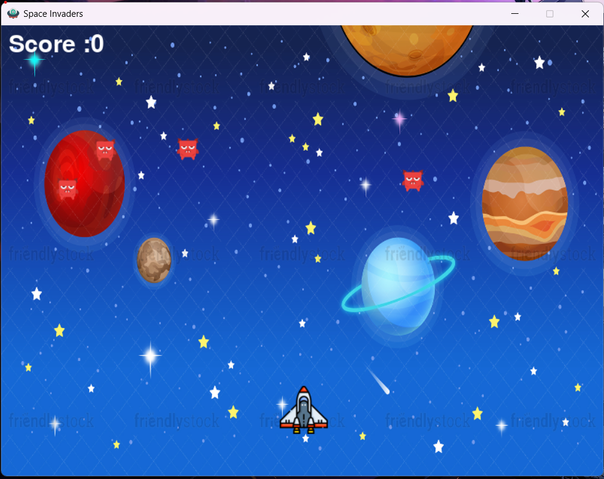

# 🚀 Space Invaders Game

A classic Space Invaders arcade game built with Python and Pygame. Defend Earth by shooting down waves of alien invaders!

  

## 🎮 Features

- **Classic Gameplay**: Move left/right and shoot enemies
- **Multiple Enemies**: 6 enemies with collision detection
- **Sound Effects**: Background music, laser sounds, and explosions
- **Score System**: Track your performance
- **Game Over**: When enemies reach the bottom

## 🕹️ Controls
- **Arrow Keys**: Move spaceship left/right
- **Spacebar**: Fire bullets
- **ESC**: Quit game

## 🛠️ Requirements
- pip install pygame

📁 Required Files
Game.py - Main game file
background.jpg - Background image
spaceship2.png - Player sprite
monster.png - Enemy sprite
bullet.png - Bullet sprite
ufo.png - Game icon
Bmusic.wav - Background music

laser.wav - Shooting sound

explosion.wav - Explosion sound
